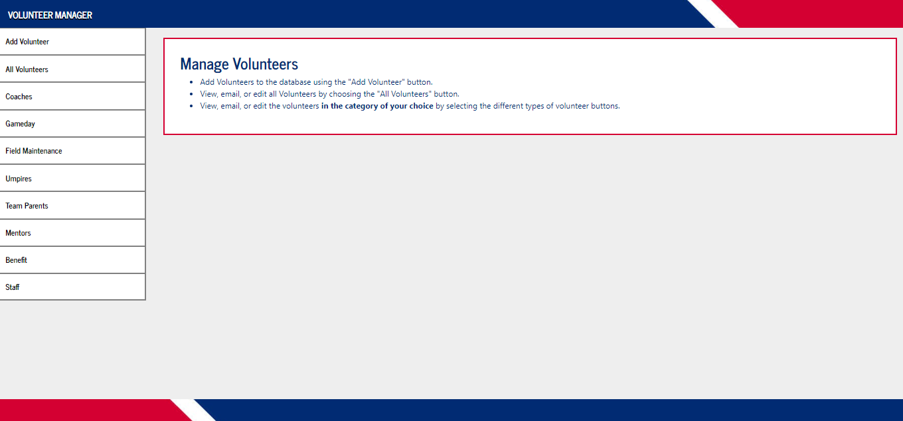

# Volunteer Manager 

<p>
  <a href="https://thawing-refuge-91413.herokuapp.com/" target="_blank">Use Live Application Here</a>
  ·
  <a href="https://drive.google.com/file/d/1Ujc38raYWveqrC5kGInm03DTCtbDzxbt/view?usp=sharing" target="_blank">View Demo</a>
  <br/>
</p>


<!-- TABLE OF CONTENTS -->
## Table of Contents

* [About the Project](#about-the-project)
  * [Built With](#built-with)
* [Getting Started](#getting-started)
* [Usage](#usage)
* [Contributing](#contributing)
* [Contact](#contact)
* [Acknowledgements](#acknowledgements)


<!-- ABOUT THE PROJECT -->
## About The Project



Volunteer Manager is a MERN stack application created to help non-profits care for their volunteers by creating, accessing, updating, and deleting their information quickly as well as simplifying communication. It was created after time spent working in the non-profit world and seeing a need for better software to serve that sector. 

As a staff member of a non-profit I used Google Docs and Sheets as the primary database for keeping track of volunteers and contact information. This proved inneficient and often times something or someone would fall through the cracks. It also made communication a nightmare. If an email wanted to be sent to one or multiple volunteers they first had to be found in the Doc or Sheet and then their email had to be copy and pasted.

The Volunteer Manager application allows for new volunteers to be created, edited, and deleted with simplicity. It allows for searching by volunteer type as well as email options for all volunteers, volunteers by type, or a single volunteer with just one click. 

Check it out by clicking through the volunteer tabs, send an email, add, delete, or update a volunteers information. 

<a href="https://thawing-refuge-91413.herokuapp.com/" target="_blank">Use Live Application Here</a>


### Built With

* [React](https://reactjs.org/)
* [JavaScript](https://www.javascript.com/)
* [Bootstrap](https://getbootstrap.com)
* [reactstrap](https://reactstrap.github.io/)
* [axios](https://www.npmjs.com/package/axios)
* [Node.js](https://nodejs.org/en/)
* [express](https://www.npmjs.com/package/express)
* [body-parser](https://www.npmjs.com/package/body-parser)
* [MongoDB](https://www.mongodb.com)
* [Mongoose](https://www.npmjs.com/package/mongoose)


<!-- GETTING STARTED -->
## Getting Started

1. Clone the repo
```sh
git clone https://github.com/austingwalker/Volunteer-Manager-MERN
```
2. Install NPM packages
```sh
npm install OR yarn install
```
3. Start the application on your local machine
```sh
npm start OR yarn start
```


<!-- USAGE EXAMPLES -->
## Usage

<a href="https://drive.google.com/file/d/1Ujc38raYWveqrC5kGInm03DTCtbDzxbt/view?usp=sharing" target="_blank">View Demo Here</a>


<!-- CONTRIBUTING -->
## Contributing

Any contributions you make are **greatly appreciated**.

1. Fork the Project
2. Create your Feature Branch (`git checkout -b feature/NewFeature`)
3. Commit your Changes (`git commit -m 'Add some NewFeature'`)
4. Push to the Branch (`git push origin feature/NewFeature`)
5. Open a Pull Request


<!-- CONTACT -->
## Contact

Austin Walker - [LinkedIn](https://www.linkedin.com/in/austin-walker-aa0aab129/) - agwalker249@gmail.com

Project GitHub Link: [https://github.com/austingwalker/Volunteer-Manager-MERN](https://github.com/austingwalker/Volunteer-Manager-MERN)

Live Application Link: [https://thawing-refuge-91413.herokuapp.com/](https://thawing-refuge-91413.herokuapp.com/)


<!-- ACKNOWLEDGEMENTS -->
## Acknowledgements
* [Heroku](https://www.heroku.com/)
